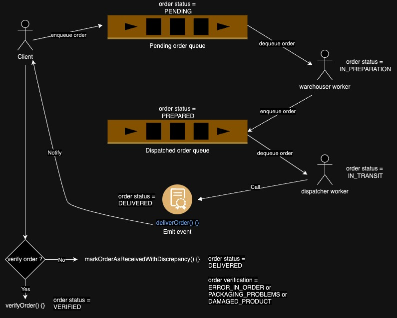

# Aplicación de Manejo de Ordenes en Solidity

Este proyecto implementa un sistema de manejo de ordenes utilizando contratos inteligentes en la red Ethereum. Los contratos permiten el manejo de clientes, trabajadores de almacén, y despachadores.



## Requisitos

- Node.js v16.0.0 o superior.
- Hardhat.
- Solidity v0.8.0 o superior.

## Instalación

1. Clona el repositorio:

```bash
git clone https://github.com/MauroPerna/order-tracking-app.git
cd order-tracking-app
```

2. Instala las dependencias

```bash
npm install
```

3. Ejecuta las pruebas

```bash
npx hardhat test
npx hardhat coverage // cobertura de pruebas
```

## Despliegue

### Ganache

```bash
npx hardhat compile --network ganache --force
npx hardhat deploy --network ganache --reset
```
